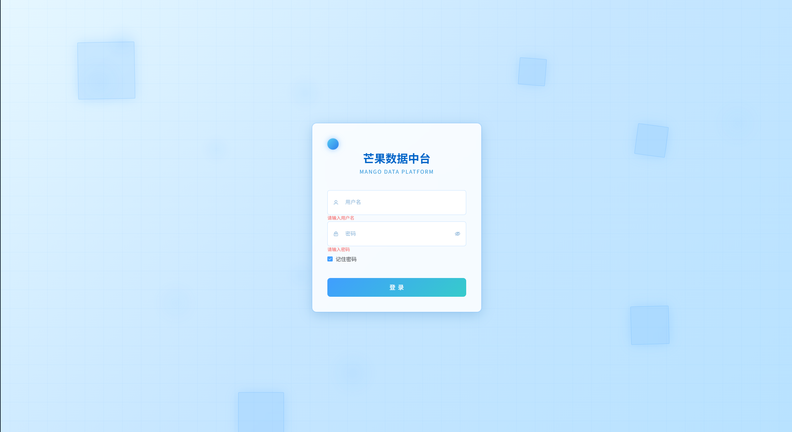
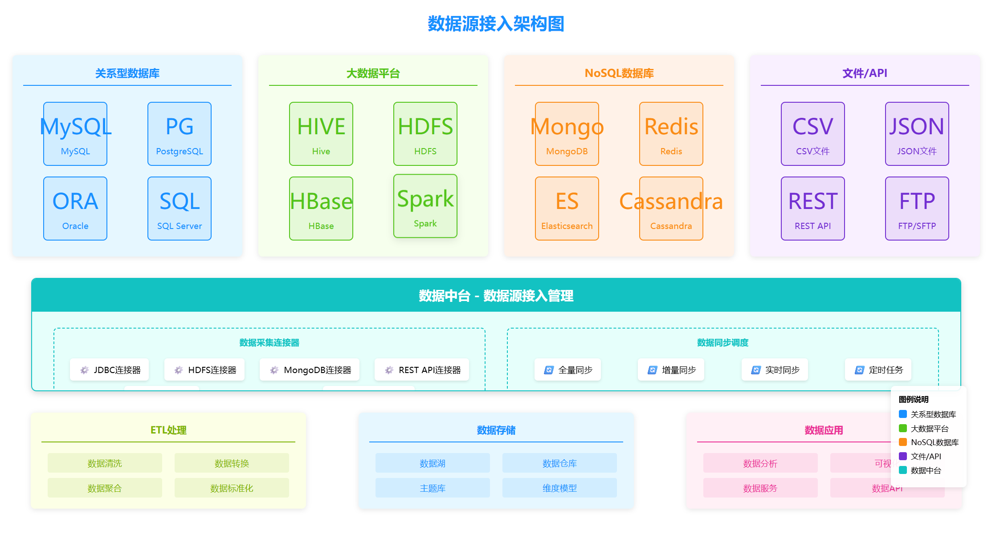
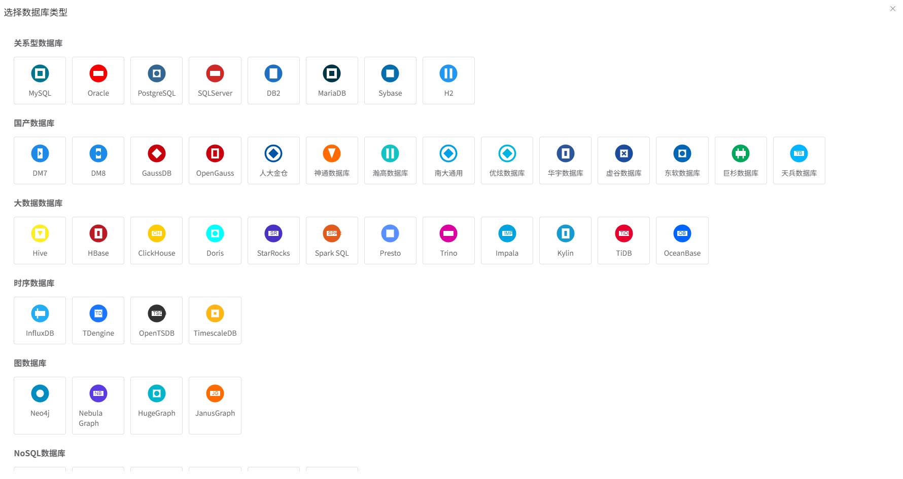
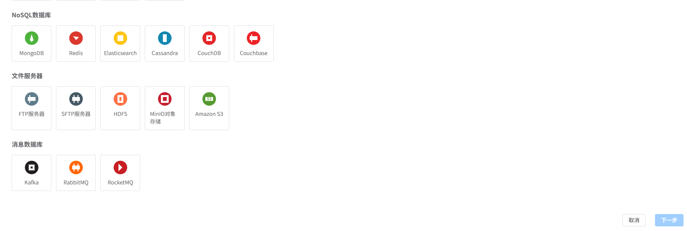
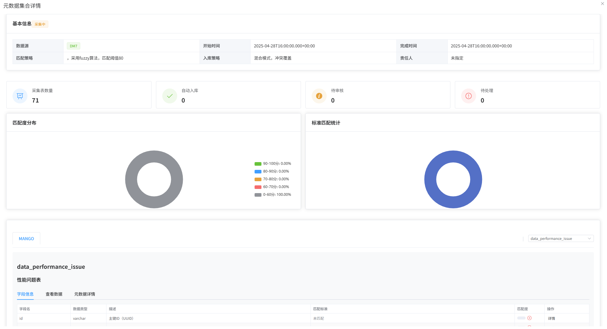
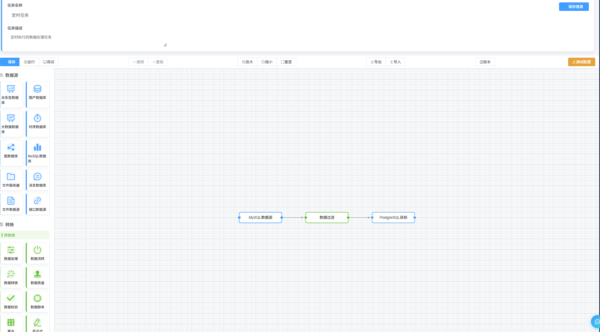
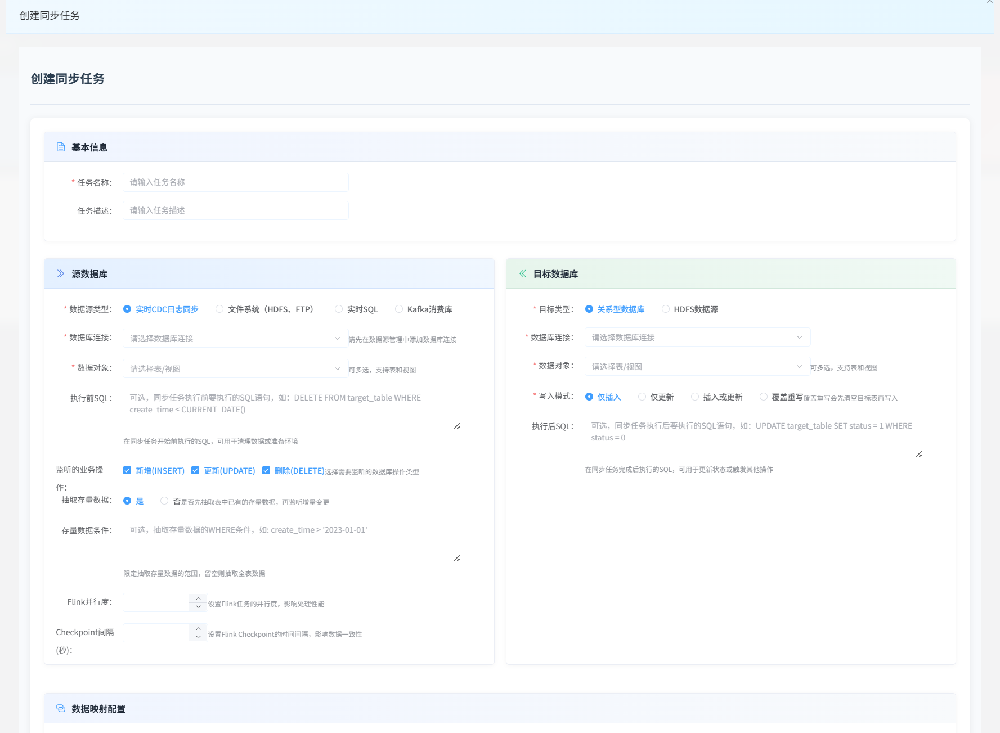
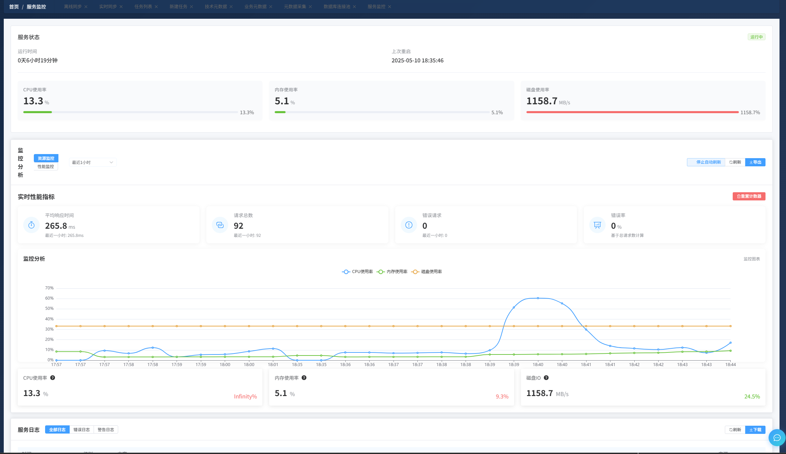

# 芒果数据中台

<p align="center">
  
</p>

<p align="center">
  <strong>面向现代企业的一体化数据治理与管理平台</strong>
</p>

<p align="center">
  <a href="#项目介绍">项目介绍</a> •
  <a href="#功能特点">功能特点</a> •
  <a href="#技术架构">技术架构</a> •
  <a href="#快速开始">快速开始</a> •
  <a href="#开发路线图">开发路线图</a> •
  <a href="#贡献">贡献</a> •
  <a href="#技术交流">技术交流</a> •
  <a href="#许可证">许可证</a>
  <a href="#系统截图">系统截图</a>
</p>

<p align="center">
  
</p>

## 项目介绍

芒果数据中台是一个全面的数据治理平台，帮助组织管理、整合、分析和保护其数据资产。它为数据专业人员提供了统一的界面，用于处理数据生命周期的各个方面，从数据集成和存储到分析和服务交付。

平台采用模块化设计，可根据企业需求灵活配置。无论是数据仓库管理、数据质量监控、元数据管理，还是数据安全和API服务，芒果数据中台都提供了一站式解决方案，帮助企业充分挖掘数据价值。

### 适用场景

- **大中型企业数据治理**：提供完整的数据资产管理和治理能力
- **数据仓库与数据湖构建**：支持从多源数据集成到统一存储
- **数据分析与商业智能**：提供强大的数据分析和可视化工具
- **数据服务与API管理**：将数据资产转化为服务接口，供内外部系统调用
- **数据质量监控**：确保企业数据符合质量标准和规范

## 功能特点

- **完整的数据生命周期管理**
  - 数据采集、清洗、转换和加载
  - 数据存储与管理
  - 数据分析与应用
  - 数据归档与销毁

- **强大的数据集成能力**
  - 支持100+数据源连接
  - 可视化ETL设计器
  - 增量与全量同步策略
  - 流式与批量处理

- **统一的元数据管理**
  - 技术元数据自动采集
  - 业务元数据标注
  - 元数据标准管理
  - 元数据检索与探索

- **全面的数据质量管理**
  - 规则模板库
  - 实时质量监控
  - 问题诊断与修复建议
  - 质量评分与趋势分析

- **灵活的数据安全策略**
  - 字段级权限控制
  - 数据脱敏与加密
  - 操作审计日志
  - 风险自动扫描

- **便捷的数据服务管理**
  - API自动生成
  - 服务版本控制
  - 流量监控与限制
  - 接口文档自动生成

- **现代化UI/UX**
  - 基于Vue 3和Element Plus构建
  - 响应式设计，适配多种设备
  - 暗夜模式支持
  - 可定制主题

- **开放的扩展架构**
  - 插件系统支持功能扩展
  - 自定义组件库
  - 集成第三方工具

## 技术架构

<p align="center">
  
</p>

芒果数据中台采用前后端分离架构，包含以下关键技术组件：

### 前端技术栈

- **核心框架**：Vue 3 + Composition API
- **UI组件库**：Element Plus
- **状态管理**：Pinia
- **路由管理**：Vue Router
- **HTTP客户端**：Axios
- **可视化图表**：ECharts 5
- **地图组件**：AMap / BMap
- **富文本编辑器**：TinyMCE / WangEditor
- **代码编辑器**：Monaco Editor
- **流程设计器**：X6 / LogicFlow
- **构建工具**：Vite
- **JS工具库**：Lodash, Day.js

### 后端技术栈

- **开发语言**：Java / Python
- **Web框架**：Spring Boot
- **ORM框架**：MyBatis / MyBatis-Plus
- **数据库**：MySQL / PostgreSQL
- **缓存**：Redis
- **消息队列**：Kafka / RabbitMQ
- **搜索引擎**：Elasticsearch
- **文件存储**：MinIO
- **微服务框架**：Spring Cloud
- **容器化**：Docker + Kubernetes
- **API文档**：Swagger / Knife4j

### 数据处理引擎

- **批处理**：Spark / Flink Batch
- **流处理**：Flink / Kafka Streams
- **ETL工具**：自研ETL设计器
- **调度系统**：Apache Airflow / XXL-Job
- **数据湖存储**：Hudi / Iceberg

## 系统模块

平台由几个集成的核心模块组成：

## 快速开始

### 系统要求

- **操作系统**：Windows、MacOS、Linux
- **浏览器**：Chrome 80+、Firefox 72+、Edge 80+、Safari 13+
- **内存**：8GB以上（推荐16GB以上）
- **存储**：50GB以上可用空间

### 开发环境搭建

#### 前提条件
- Node.js (v14+)
- Java JDK 1.8
- MySQL 5.7+
- Redis 5+
- Maven 3.6+
- Git

#### 前端开发环境

1. 克隆仓库
```bash
git clone https://github.com/mangoDataAi/mango-Data.git
cd mango-Data/mango-web
```

2. 安装依赖
```bash
npm install
```

3. 修改配置文件
```bash
# 复制配置文件
cp .env.example .env.local

# 编辑配置文件，设置API地址等
```

4. 启动开发服务器
```bash
npm run dev
```

5. 构建生产环境
```bash
npm run build
```

#### 后端开发环境

1. 进入后端目录
```bash
cd mango-Data/mango-server
```

2. 修改配置文件
```bash
# 编辑application.yml，配置数据库连接等
```

3. 编译项目
```bash
mvn clean package -DskipTests
```

4. 启动服务
```bash
java -jar target/mango-server.jar
```

服务启动后，访问 http://localhost:8080 即可体验系统功能。

默认管理员账号密码：
- 用户名：admin
- 密码：admin

## 开发路线图

我们计划在未来版本中添加以下功能：

### 短期计划（1个月内）
- [ ] 开源更多数据源类型
- [ ] 增强数据质量规则引擎
- [ ] 优化元数据采集效率
- [ ] 添加数据血缘可视化图

### 中期计划（2个月内）
- [ ] 集成AI辅助功能，支持智能数据分析
- [ ] 增加数据湖存储支持
- [ ] 添加流式处理能力增强
- [ ] 提供完整的多语言支持

### 长期计划（4个月内）
- [ ] 实现全面的多云支持
- [ ] 提供边缘计算整合方案
- [ ] 建立插件市场生态系统
- [ ] 增强数据安全和隐私保护功能

## 贡献

我们欢迎各种形式的贡献，包括功能请求、bug报告、代码贡献、文档改进等。

## 许可证

[MIT License](LICENSE)

## 技术交流
  欢迎各位添加微信进行技术交流（mango202501），我们会建立的自己的微信群进行技术交流，芒果目前处于前期，非常欢迎各位进行交流。
<p align="center">
  
</p>

## 致谢

芒果数据中台基于众多优秀的开源项目构建，我们对这些项目表示感谢：

- [Vue.js](https://vuejs.org/)
- [Element Plus](https://element-plus.org/)
- [Spring Boot](https://spring.io/projects/spring-boot)
- [MyBatis](https://mybatis.org/)
- [Apache Spark](https://spark.apache.org/)
- [Apache Flink](https://flink.apache.org/)
- [ECharts](https://echarts.apache.org/)
- [更多...](ACKNOWLEDGEMENTS.md) 

## 系统截图
<p align="center">
  
</p>
<p align="center">
  
</p>
<p align="center">
  
</p>
<p align="center">
  
</p>
<p align="center">
  
</p>
<p align="center">
  
</p>
